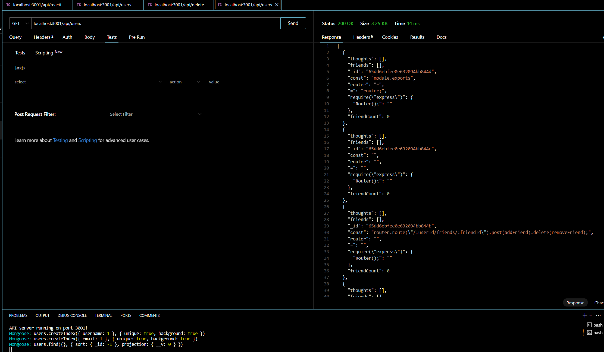

# SocialNetworkApi-NoSQL
module 18 challenge Social network NoSQL

## Description
Creating an API for social network, a place where users can add friends, share thoughts and reactions with each other.

## User Story
AS A social media startup
I WANT an API for my social network that uses a NoSQL database
SO THAT my website can handle large amounts of unstructured data

## Acceptance Criteria
GIVEN a social network API
WHEN I enter the command to invoke the application
THEN my server is started and the Mongoose models are synced to the MongoDB database
WHEN I open API GET routes in Insomnia for users and thoughts
THEN the data for each of these routes is displayed in a formatted JSON
WHEN I test API POST, PUT, and DELETE routes in Insomnia
THEN I am able to successfully create, update, and delete users and thoughts in my database
WHEN I test API POST and DELETE routes in Insomnia
THEN I am able to successfully create and delete reactions to thoughts and add and remove friends to a user’s friend

## Installation
-npm init -y
-npm install mongoose, moment, express

## Instructions
-npm start

## Tests
all /api/user
all /api/thought
GET all user, user by id 
POST new user, user by id
DELETE user, user by id

POST, DELETE, GET Thought

POST create Reaction

## Contribution
Made by Chris Huynh

## Links
Github Repo: https://github.com/ceewizz/SocialNetworkApi-NoSQL

